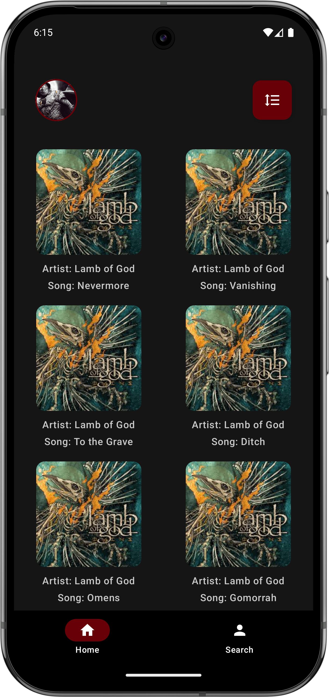
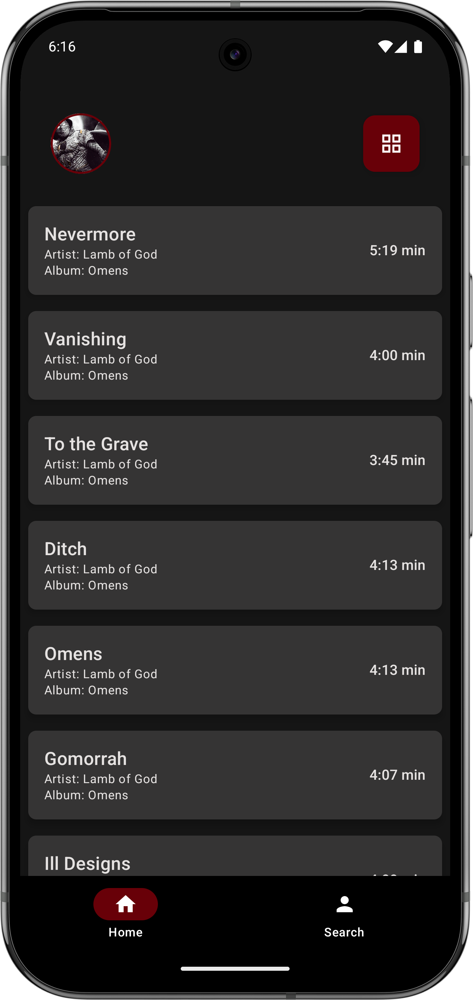
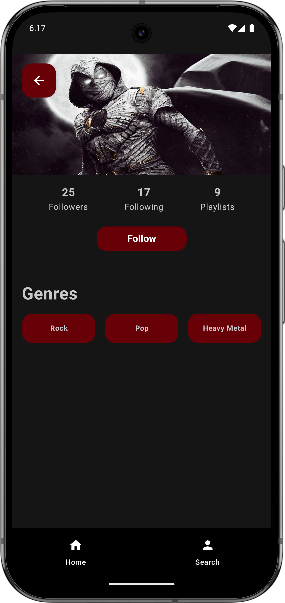
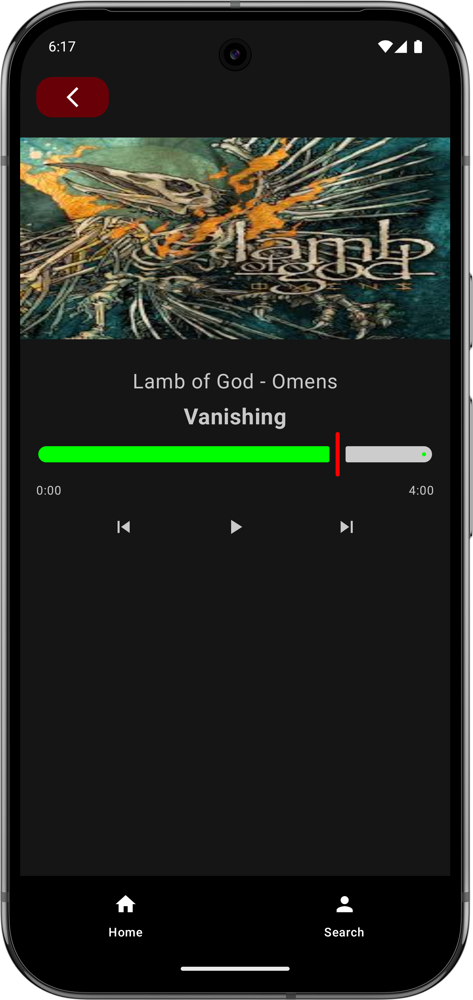
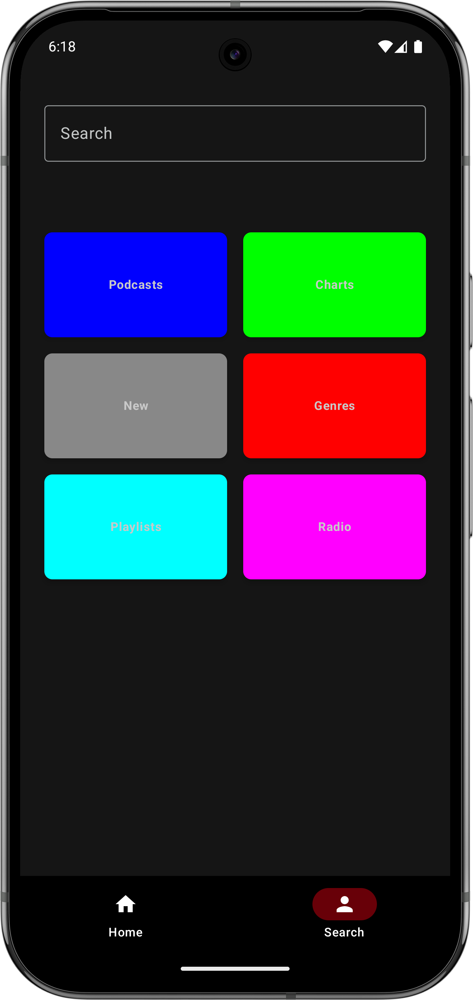

# Musik App

Musik App is an Android application designed as a training project to demonstrate modern UI, navigation, and component structuring. The app features a clean and intuitive interface with sections such as Home, Search, Profile, and Song List/Grid views. Please note: this app does not play music and does not connect to any external API; all data is static and for demonstration purposes only.

## 📸 Screenshots

## 🌟 Key Features

- Browse and search through a static list of songs
- View songs in grid or list format
- User profile section
- Smooth navigation between different sections

## 🛠️ Built With

*   [Kotlin](https://kotlinlang.org/) - The programming language used.
*   [Jetpack Compose](https://developer.android.com/jetpack/compose) - Android's modern toolkit for building native UI.

---

> **Note:**  
> This project was developed as part of my training. It showcases the skills and concepts I learned during that period. Please feel free to explore the code and reach out if you have any questions!

--- 